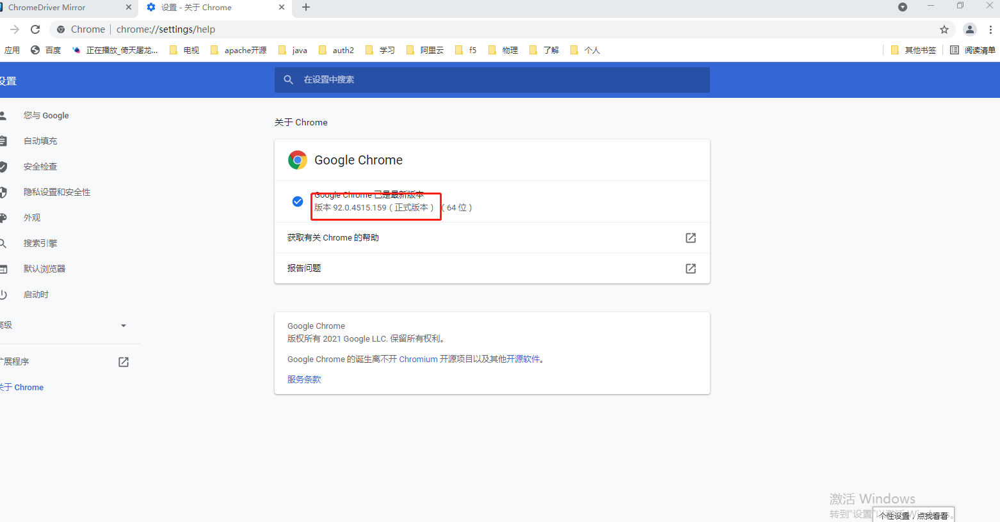
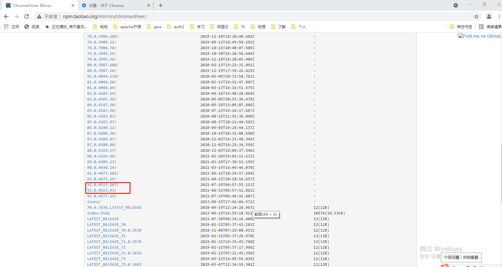
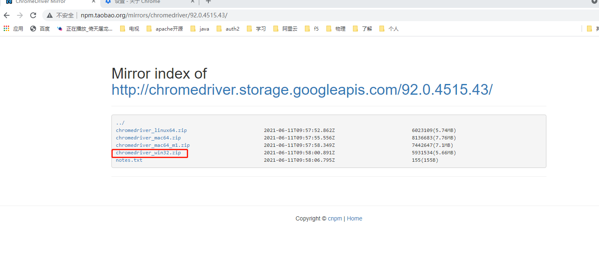

# 使用说明
#### 安装chrome浏览器，若已安装则跳过此步骤

- 通过下载链接https://www.google.cn/chrome/下载，并安装

- 找出浏览器版本号并记录

  ```
  1 打开谷歌浏览器
  2 在浏览器 地址栏最右方（界面在右上角，点击 关闭窗口图标[x]下图标[...[竖]]）
  3 选择[帮助]-->[关于google chrome]
  4 查看中间栏信息， google chrome图标下有具体的版本信息，例如 版本 91.0.4472.164（正式版本） （64 位）
  5 记下这个版本号， 下载相应的浏览器驱动
  ```

  第二步图示：

  

  第五步图示：

  

#### 下载驱动

- 打开下载链接 http://npm.taobao.org/mirrors/chromedriver/

- 根据找到的版本号，下载相应版本的驱动， 如http://npm.taobao.org/mirrors/chromedriver/91.0.4472.19/

- 把下载的驱动解压后，把chromedriver.exe驱动文件复制到 bubble\drivers\chrome目录下(覆盖旧的)

  

   